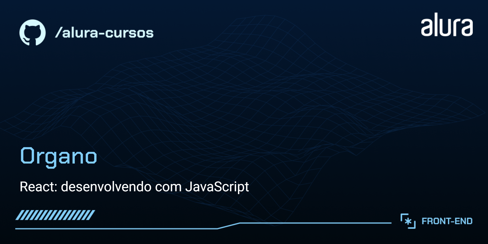

# Organo

> Do curso da Alura:
React: desenvolvendo com JavaScript

O Organo é um aplicativo para organização de equipes.

## 🔨 Funcionalidades do projeto

O aplicativo permite a inclusão de membros em diferentes equipes, no caso nas equipes de desenvolvimento da Alura (Programação, Front-end, Data Science, Devops, UX e Design, Mobile e Inovação e Gestão).

## ✔️ Técnicas e tecnologias utilizadas

As técnicas e tecnologias utilizadas pra isso são:

-  : construção do conteúdo da página
-  : estilização da página e responsividade
-  : interatividade da página
-  : desenvolvimento dos diversos componentes da página
-  : estrutura do projeto
-  : fonte do projeto UI / UX
-  : controle de versão
-  : repositório do código
-  : hospedagem do site
-  : IDE

## 📁 Acesso ao projeto

Você pode acessar o resultado do projeto no [Vercel](https://organo-alura.vercel.app/).

